# 🌟Wu通讯调试工具

## ✨软件特色
- 🌈支持ModbusRtu、Mqtt服务器、Mqtt客户端
- 🎨界面色彩丰富
- 🍭ModbusRtu自动解析数据帧
- 🔖智能防粘包，速度快也能解析

## 🌈功能介绍
1. ☀️Modbus Rtu 
- 🌻自动格式化解析和验证数据帧
- 🌵自定义帧  支持自动校验
- 🍄搜索设备  可设置多种组合，自动搜索设备
- 🌴数据监控  可设置字节序、数据类型等，支持读取与写入
- 🌱自动应答
2. 🐲Modbus TCP
- 🌵自定义帧
- 🔧功能开发中...
3. 🌷Mqtt Server
- 🌼在本地开启Mqtt服务器供客户端连接测试
- 🌾右键消息可对Json格式的数据进行格式化查看
4. ⛅Mqtt Client
- 🐅可开启Mqtt客户端连接Mqtt服务器
- 🐇提供订阅管理, 可订阅与取消订阅
- 🐳右键消息可对Json格式的数据进行格式化查看
6. 🎄Json格式化查看
7. 🌞转换工具

## 🌊Modbus Rtu
### 🐬Modbus Rtu 自定义帧
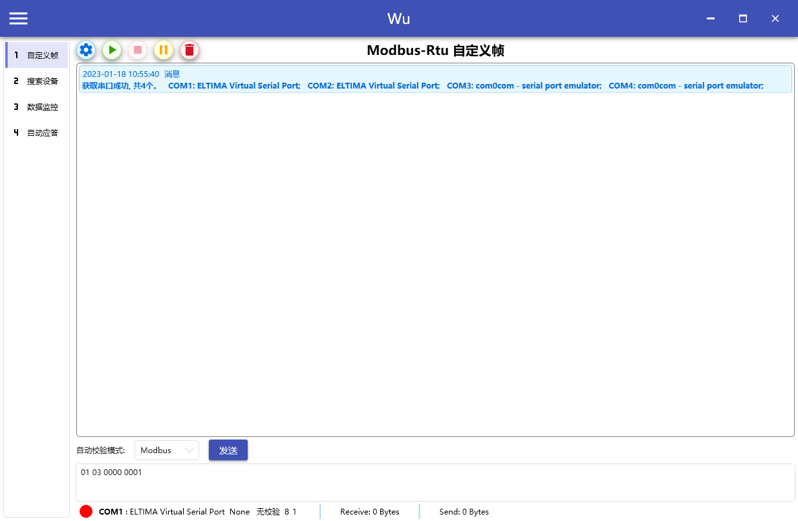

### 🔎Modbus Rtu 搜索设备
参数设置, 可选择多个波特率与校验方式
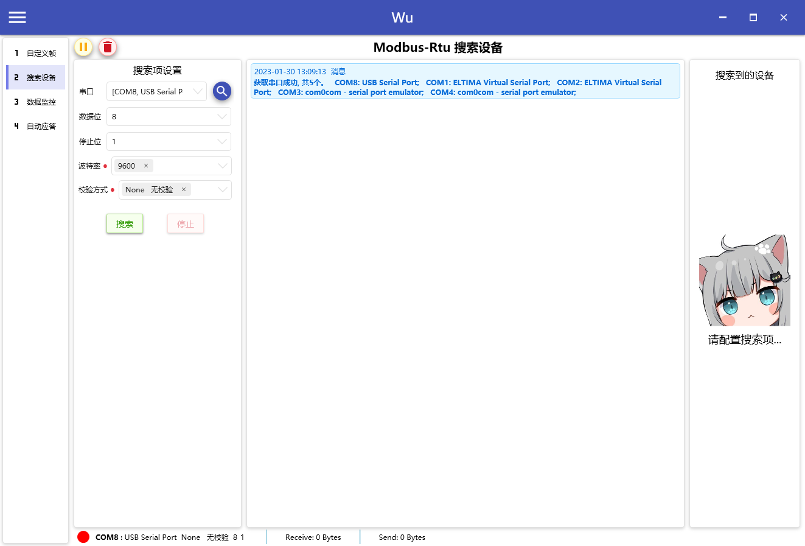
搜索到的设备将在右侧显示
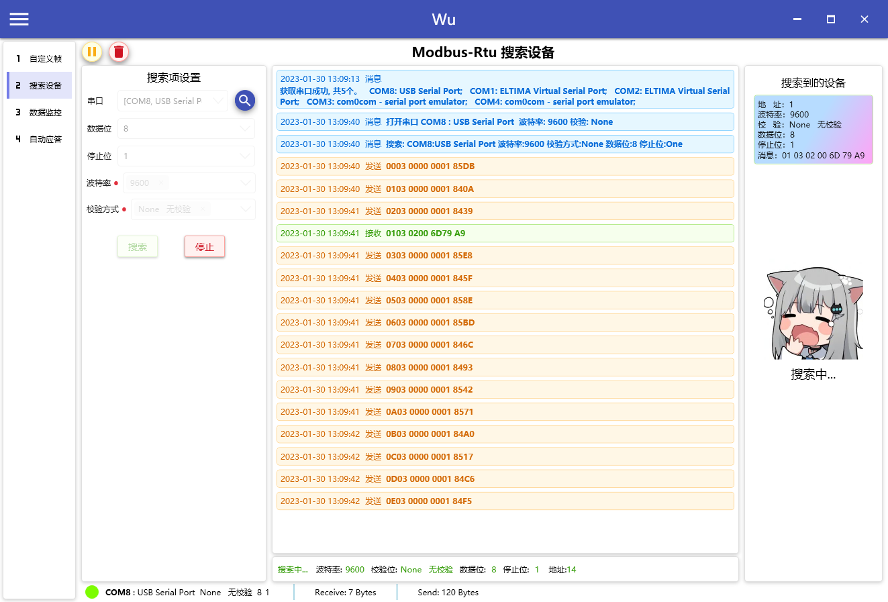

### 🐏Modbus Rtu 数据监控
数据监控设置,可导出配置,方便下次快捷导入。
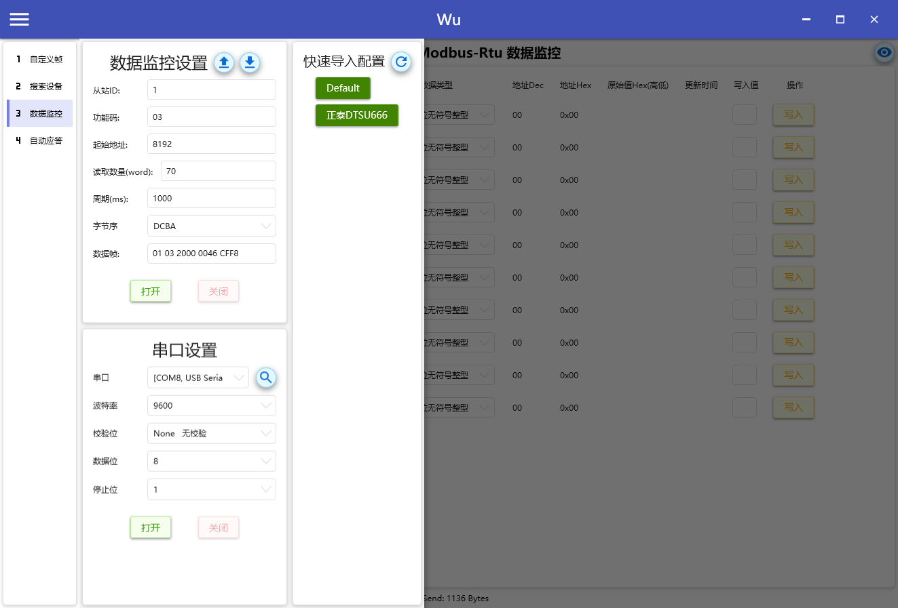

数据监控可设置数据类型，倍率等，若值不正确考虑修改**字节序**。 支持读写的地址可使用写入功能。
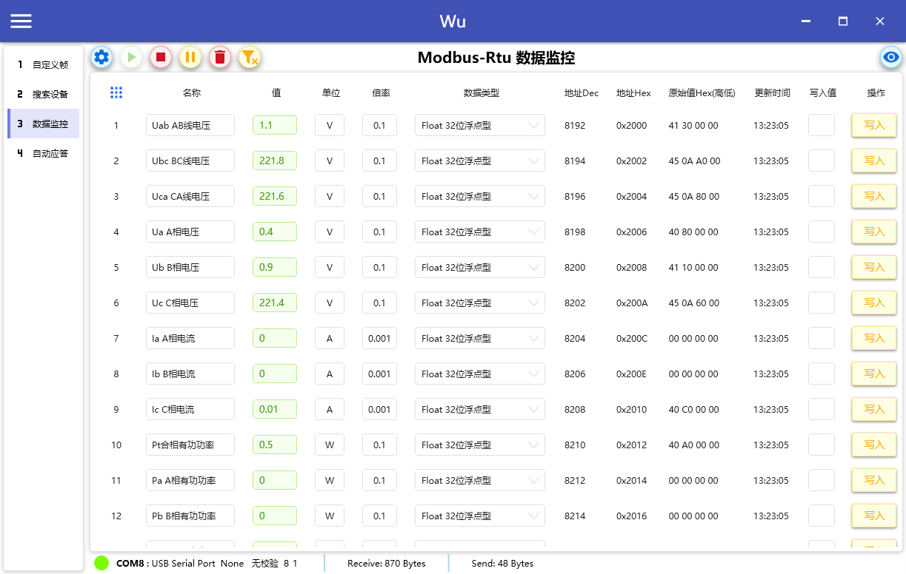

### 🐙Modbus Rtu 自动应答
设置好匹配模板和应答模板，接收到数据与匹配模板相同时将自动发送应答模板
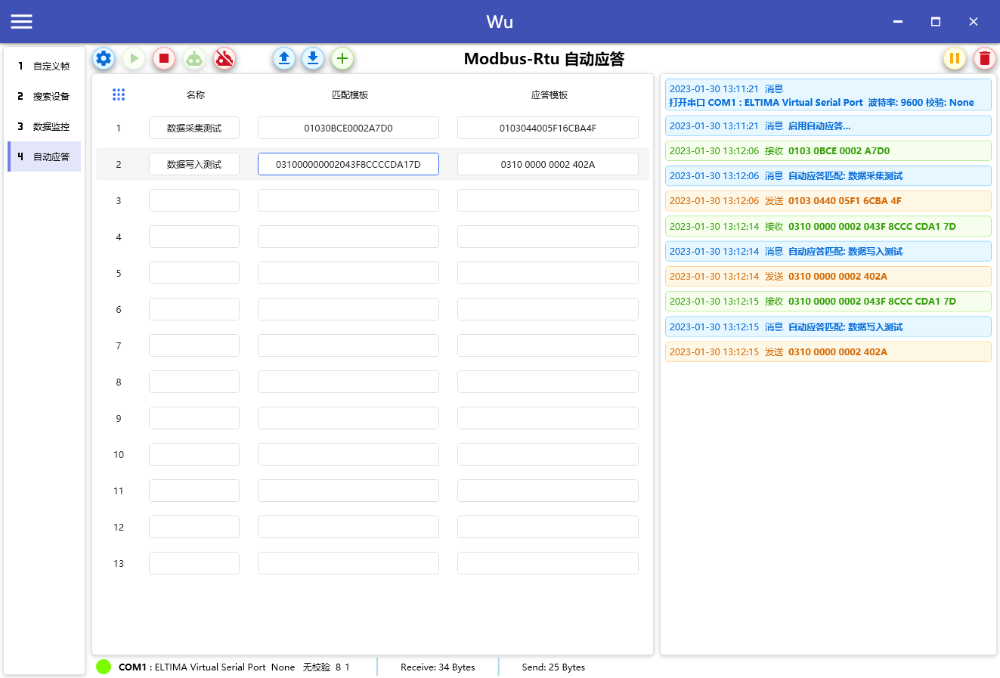

## 🐲Modbus TCP
### 🐇Modbus TCP 自定义帧
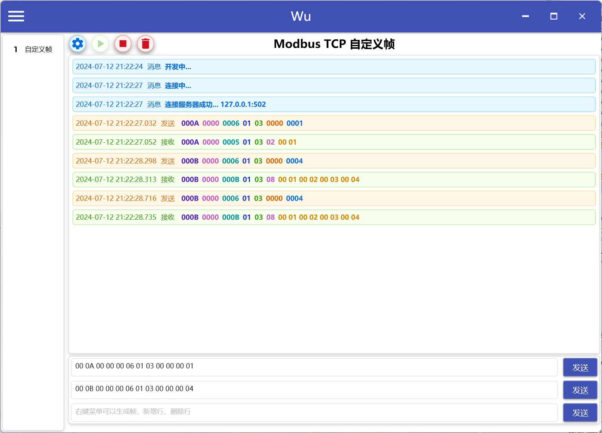
### 🐅Modbus TCP 帧解析
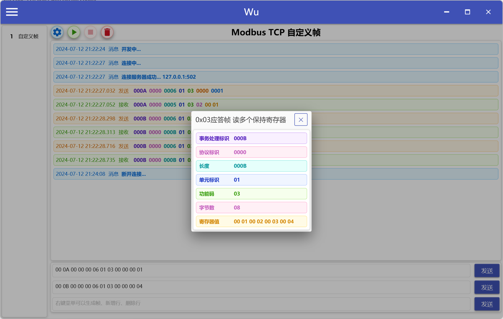

## 🌻Mqtt Server
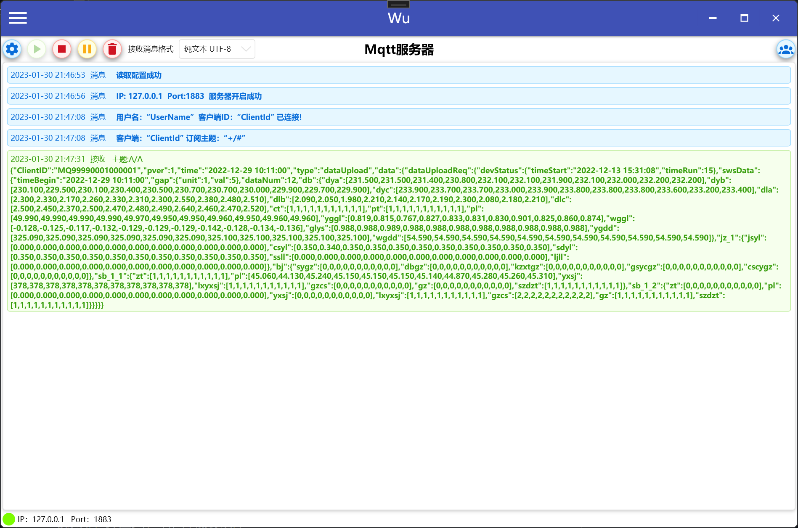

右键消息可查看格式化Json
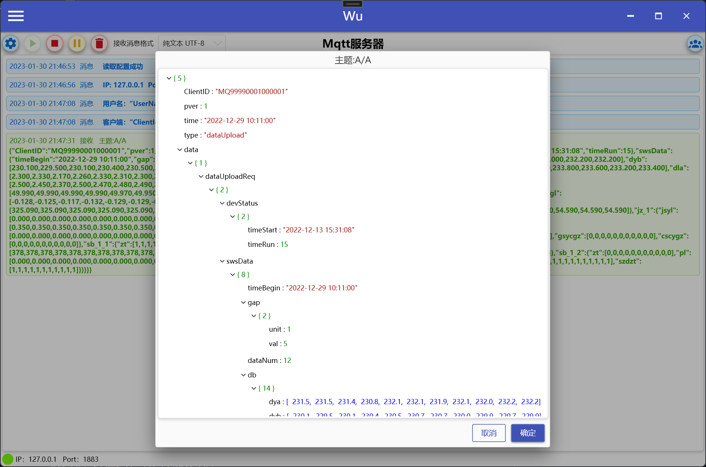

## 🍁Mqtt Client
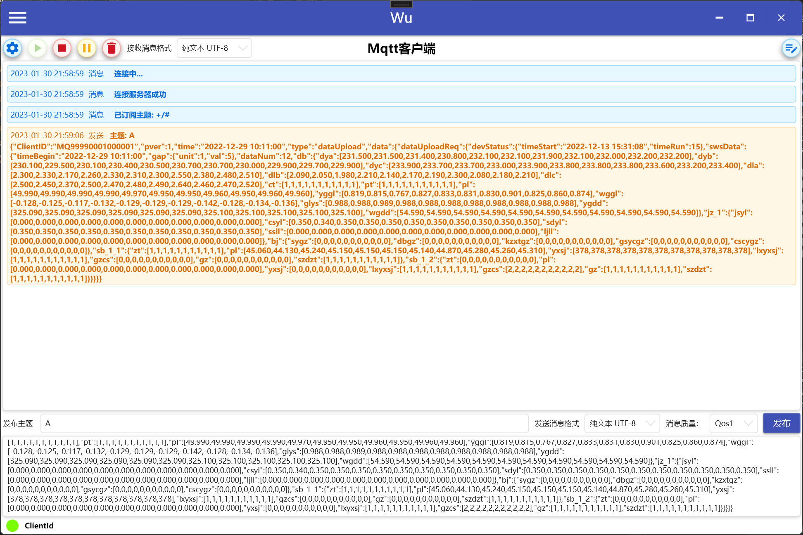

## 🌞转换工具
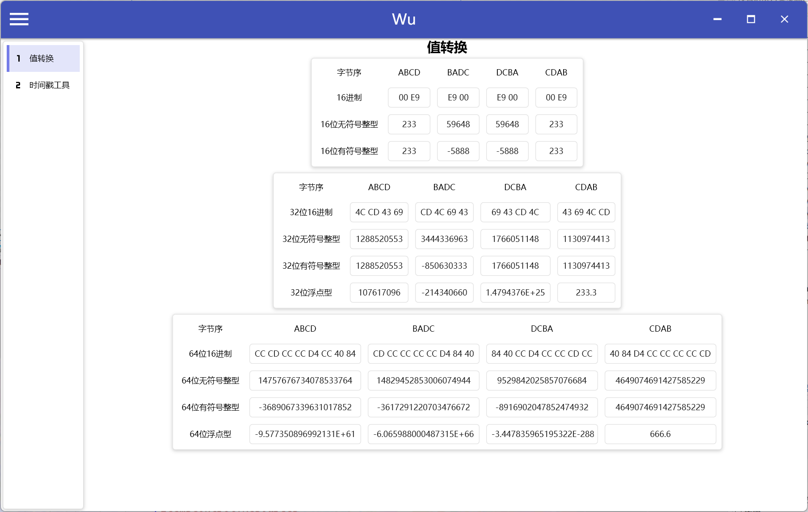

## 📦如何下载
- 仅支持windows系统, 需安装.NET 6
- 进入 [Release](../../releases) 页面下载，下载WuCommTool.zip

## ⭐联系作者
- QQ：961501261
- QQ群: 746533921
